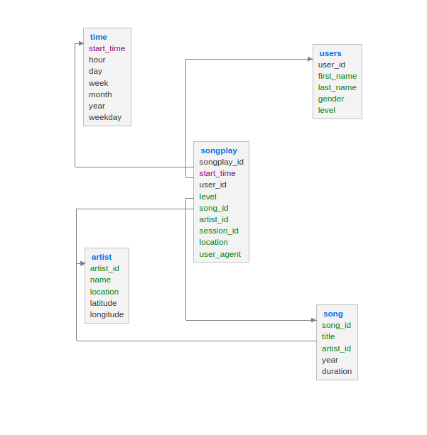
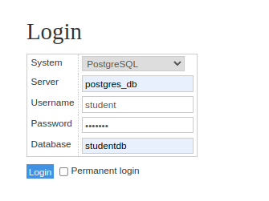

# Udacity Data Engineer Nanodegree Project-1

## Project Description: 
Sparkify is an analytics company who is interested with understanding about the songs users are interested in listening to. At the present state, this is hard since the data for the company resides in logs which is in JSON format and querying it is hard. Hence, they want a Data Engineer to envision a solution to create database schema, tables and create an etl pipeline to allow for them to query data. 

## Goals:
1. To be able to create the data schema adhering to all the requirements.
2. To be able create tables and apply ETL pipeline.
3. Additionally, perform some data quality checks such as avoiding data duplication.

## Project Datasets Description:  
1. Song Dataset: Subset of a larger Song data dataset is provided for the analysis to create ETL pipeline.
   1. File format: JSON  
   2. Contains: Song and artist details
   3. Partition: Over first three letters of track id.
  
2. Log data: Simulated Log data is provided
   1. Format: JSON
   2. Partition: Year and Month

## Project Description:  
The project folder structure is as follows:  
```
project
  |
  |-- data/
  |-- db/
  |-- create_tables.py
  |-- etl.ipynb
  |-- etl.py
  |-- sql_queries.py
  |-- test.ipynb
  |-- requirements.txt
  |-- docker-compose.yml
```
1. data: This folder contains the underlying dataset both for log_data and song_data (subset of the larger dataset).
2. db - This folder contains an init database creation for the postgres docker-container.
3. create_tables.py - This python file acts as a wrapper which works as follows:  
   1. `create_database()`: This function first connects to the student database and then drops if already existing sparkify database and recreates it. It  written back the connection curr required for next operations.
   2. `drop_tables(cur, conn)`: This function drops the tables in the database only if they exists. The queries for each of the drop commands are provided in the `sql_queries.py` which is imported at `create_tables.py`. An example drop query is: `DROP TABLE IF EXISTS users`. I also learnt that one cannot simply create a `user` table since it is reserved keyword.
   3. `create_tables(cur, conn)`: This function as the name says allows to create tables required for the data ingestion into Fact and Dimension tables of the sparkify database.
4. etl.ipynb - This can only be used after creating the tables. Note: Since, my database design following primary key and foreign key relationships, I had to first insert data into artists table and then into the songs table since songs have `artist_id` as the foreign key. This jupyter notebook allows to do some experiments with the data understand the schema of the data itself using pandas apply some transformations required, so that it can to moved to the actual etl.py file.
5. etl.py - This acts as the complete etl pipeline system which first extract each of the data from song and log data. Applies certain cleaning of data, transformations and finally inserts it into the respective tables. It should be noted that this can be called only after creating the table using `create_tables.py`.

Some of the code snippet of this file are explained. The same is also details as comments in the file.  
1. process_data(cur, conn, filepath, func): It should be noted that this function accepts func (process song_data or log_data) as parameter, filepath is where the data lies (data/song_data or data/log_data). At first, each file is iteration based on the given path, glob allows to obtain the absolute path of the file which can then be read using pandas.
```
all_files = []
for root, dirs, files in os.walk(filepath):
   files = glob.glob(os.path.join(root, "*.json"))
   for f in files:
      all_files.append(os.path.abspath(f))

# Then each file is iterated over all_files to process song_data, or log_data.
```
2. process_song_file(cur, filepath): This function reads the `filepath` for the song_file and after transformation it is inserted into the respective tables. It should be noted that there is try except block to catch the `UniqueViolation` exception while trying to insert duplicate data on `id's` which is a primary key.
3. process_log_file(cur, filepath): This function reads the log_file data. Unlike song_data which only had one entry for each of the JSON file, the log file has more than one entry thus some cleaning are also performed to avoid duplicacy, nulls and '' string in the data. The method that does it is `clean_data(df, na_subset,dup_subset=None)` which allows to provide the subset of columns on which something should be applied. In our case they are over the ts, user_id columns. For the timestamp processing the following snippet is applied using the pandas dt attributes. This method also finally inserts into the `songplays` Fact table.
```
t = df.copy()
t["ts"] = t["ts"].apply(lambda x: pd.to_datetime(x, unit="ms"))
t["hour"] = t["ts"].apply(lambda x: x.hour)
t["day"] = t["ts"].apply(lambda x: x.day)
t["week"] = t["ts"].apply(lambda x: x.week)
t["month"] = t["ts"].apply(lambda x: x.month)
t["year"] = t["ts"].apply(lambda x: x.year)
t["weekday"] = t["ts"].apply(lambda x: x.dayofweek)
time_df = t[["ts", "hour", "day", "week", "month", "year", "weekday"]]
```

## Database Schema for Song play analysis:  
The following image depicts the designed database schema for the project:  


Let us now look into each of the table and their data types:  
1. songplays:  
```
|songplay_id|SERIAL|NOT NULL PRIMARY KEY|
|start_time|timestamp|
|user_id|int|
|level|varchar|
|song_id|varchar|
|artist_id|varchar|
|session_id|varchar|
|location|varchar|
|user_agent|text|

Details:
1. Here, songplay_id is an auto_increment id which cannot be NULL and is primary key of the table. Adding such conditions allows to not have any anomalies. The user_agent is long text about information regarding the request of user such as which operating system, device etc which is on a variable length. A length check to varchar(n) can also be added, however I would consider that an extension as it not easy to judge any right length on the textual data.
2. The start_time, user_id, song_id, artist_id act as a foreign key referencing to each of the tables.
```

2. users:
```
|user_id|int|NOT NULL|PRIMARY KEY
|first_name|varchar|
|last_name|varchar|
|gender|varchar|
|level|varchar|

1. Here, user_id acts as a primary key and is of an int type because by looking the first few rows and info of the log data it was seen the it is integer type represented as an object.
2. There were many NULLS appearing in the data. Hence, there are no explicit checks for NULLS or unique to other data. Some of the attribute values seen were level - [paid, free], gender - [M, F]
```

3. songs:  
```
|song_id|varchar|NOT NULL PRIMARY KEY|
|title|varchar|
|artist_id|varchar|
|year|int|
|duration|float|

Here, song_id acts a primary key. While investigating the data in the etl.ipynb it was seen that duration is of float type. The artist_id is a foreign key.
```

4. artists:  
```
|artist_id|varchar|NOT NULL PRIMARY KEY|
|name|varchar|
|location|varchar|
|latitude|float|
|longitude|float|

Here, artist_id acts a primary key. The location is the Actual location followed by state Example: Hamtramck, MI. The latitude and longitude columns were mostly NaN. Since, the datatype for latitude and longitude are float the same is considered.
```

5. time:  
```
|start_time|timestamp|NOT NULL PRIMARY KEY|
|hour|int|
|day|int|
|week|int|
|month|int|
|year|int|
|weekday|int|

start_time is datetime format after converting the milliseconds time in the ts column.
Example:
ts:
ms - 1541292603796
timestamp (utc) - 2018-11-04 00:50:03.796
This is of the format YYYY-MM-DD HH:MM:SS.Z
From this information the required attributes are extracted which is highlighted above.
```

5. Song select query:  
```
SELECT songs.song_id, artists.artist_id FROM songs
JOIN artists ON songs.artist_id = artists.artist_id
WHERE songs.title = %s and artists.name = %s and songs.duration = %s

This query is written to perform the matching with song_data and log_data. The results are combined with log_data to be inserted into the songplays table. 
```

## How to run the the project:
1. Clone the project. `https://github.com/prakass1/udacity-sparkify-etl.git` and change directory into the project directory `cd udacity-sparkify-etl`.
2. Create a python environment `python3 -m venv .venv` and activate it with `source .venv/bin/activate`.
3. Run the requirements for the project `pip install -r requirements.txt`
4. Assuming docker and docker-compose is setup. The postgres database container can be brought up with `docker-compose up -d postgres_db`. Also, adminer is setup to lookup database and tables. Run `docker-compose -d adminer`.
5. Check if the connections are in place using the adminer interface. Login to adminer at `http://localhost:9080`. Then add the following configurations in the interface: The username and password is `student`.  

6. Once after `create_tables.py` and `etl.py` is executed the database and tables with data should be populated and can be checked by choosing the DB as `sparkifydb``on the left side of the adminer interface.
7. To run the `create_tables.py` on the terminal run `python3 create_tables.py`.
8. To run the `etl.py` on the terminal run `python3 etl.py`. The etl.py has a function write_duplicate_records() which writes the duplicate entries per run in the `duplicate_records.txt` for the auditing purposes. Please note that exception is printed so you might see `duplicate key error` message. That is done only to notify with the pipeline run and is not an error.

## Analytical queries of interest  
In the test.ipynb some of the interesting analytics questions are answered through SQL queries. Below the results are shown:  

1. What are the current distribution of users using the app?  
   ```
   SELECT users.gender, COUNT(*) as counts FROM users GROUP BY users.gender;
   ```
   ```
   |gender|counts|
   | M    |  41  |
   | F    |  55  |
   ```

From this, it can be seen that female users are using the application and overall there are not major difference in the number. However, the data under consideration is only a subset.  

2. How many paid users are using the application based on the location ordered in the descending order.
   ```
   SELECT songplays.location, COUNT(songplays.level) as counts FROM songplays WHERE songplays.level = 'paid' GROUP BY songplays.location ORDER BY counts DESC;
   ```
   ```
   |location|counts|
   |San Francisco-Oakland-Hayward, CA|650|
   |Portland-South Portland, ME|648|
   |Lansing-East Lansing, MI|557|
   |Chicago-Naperville-Elgin, IL-IN-WI|462|
   |Atlanta-Sandy Springs-Roswell, GA|428|
   |Waterloo-Cedar Falls, IA|397|
   |Lake Havasu City-Kingman, AZ|321|
   ```

3. To help marketting the app better, the team is interested to know which devices are mostly using the app.
   ```
   SELECT 'Windows' as os, COUNT(*) FROM songplays WHERE songplays.user_agent LIKE '%Windows%' UNION SELECT 'Mac' as os, COUNT(*) FROM songplays WHERE songplays.user_agent LIKE '%Mac%' UNION SELECT 'Linux' as os, COUNT(*) FROM songplays WHERE songplays.user_agent LIKE '%Linux%';
   ```
   ```
     |os|count|
     |Linux|1153|
     |Mac|3239|
     |Windows|2428|
   ```

It can be noticed that the requests are high from people using Mac. It is interesting to see that there quite some linux users as well.  

4. The team is interested to know how many users listen to the songs in the night time.
   ```
      SELECT count(*) as midnight_listeners FROM songplays JOIN time ON songplays.start_time = time.start_time where time.hour >= 0 and time.hour <= 4;
   ```
   ```
   |midnight_listeners|
   |671|
   ```
